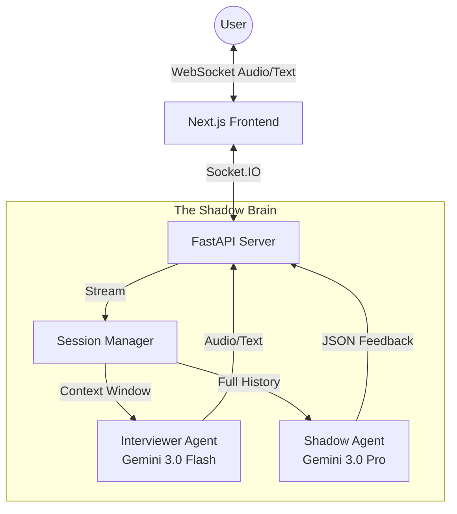

# The Shadow Instructor


> **Master your next interview with your own AI Shadow.**
>
> A real-time, dual-agent interview simulation platform powered by Google's Gemini 3.0.

---

## Introduction

**The Shadow Instructor** is a next-generation interview preparation platform that doesn't just simulate an interview—it *shadows* you. By leveraging a unique **Dual-Agent Architecture**, we provide an experience that is both adversarial and supportive:

1.  **The Interviewer (Gemini 3.0 Flash)**: Conducts a high-pressure, realistic technical interview tailored to your resume.
2.  **The Shadow (Gemini 3.0 Pro)**: Silently observes the interaction, analyzing your answers, pacing, and confidence in real-time, providing critical "heads-up" feedback without interrupting the flow.

---

## Gemini 3 Integration

This project was built specifically to showcase the capabilities of the **Gemini 3.0** model family.

### 1. Ultra-Low Latency Conversation (Gemini 3.0 Flash)
We use **Gemini 3.0 Flash** for the `Interviewer Agent` to achieve near-human response times. The model processes the candidate's audio input and generates relevant, context-aware follow-up questions instantly, maintaining the natural rhythm of a stressful interview.

### 2. Complex Reasoning & analysis (Gemini 3.0 Pro)
We use **Gemini 3.0 Pro** for the `Shadow Agent`. This agent runs in parallel, processing the full transcript and metadata. It uses Gemini 3's superior reasoning capabilities to:
- Detect technical inaccuracies in real-time.
- Analyze communication patterns (rambling, hesitation markers).
- Generate a comprehensive, structured "Shadow Report" after the session.

### 3. Multimodal Context
The system ingests **PDF Resumes** and parses them to seed the context for both agents, ensuring every question is relevant to the candidate's actual experience.

---

## Key Features

- ** Realistic Personas**: Choose your interviewer's style—from "Friendly Recruiter" to "Tough FAANG Engineer".
- ** Real-Time Feedback**: Receive subtle, ephemeral notifications during the interview (e.g., *"Speak faster"*, *"Make eye contact"*).
- ** Resume Parsing**: Upload your PDF resume, and the AI will grill you on your specific bullet points.
- ** Comprehensive Reports**: Get a detailed breakdown of your performance, including a transcript analysis and actionable tips for improvement.
- ** Secure Architecture**: Built with privacy in mind, using ephemeral tokens and secure WebSocket connections.

---

## Architecture

The system follows a proprietary **Dual-Agent State Machine**:



---

## Technology Stack

- **Frontend**: Next.js 16, TypeScript, Tailwind CSS, Framer Motion
- **Backend**: Python 3.12, FastAPI, WebSockets
- **AI Models**: Google Gemini 3.0 Flash, Gemini 3.0 Pro
- **Infrastructure**: Vercel (Frontend), Render (Backend)

---

## Quick Start

### Prerequisites

- Node.js v18+
- Python 3.10+
- Google Cloud API Key (with Gemini API enabled)

### 1. Backend Setup

```bash
cd backend
python -m venv venv
# Windows
.\venv\Scripts\activate
# Mac/Linux
source venv/bin/activate

pip install -r requirements.txt
```

Create a `.env` file in the `backend` directory:
```env
GEMINI_API_KEY=your_google_api_key
```

Run the server:
```bash
uvicorn app.main:app --reload
```

### 2. Frontend Setup

```bash
cd frontend
npm install
npm run dev
```

Visit `http://localhost:3000` to start your customized interview session!

---

## Hackathon Submission

**Project Name**: The Shadow Instructor
**Track**: Gemini 3 Hackathon
**Team**: [Your Team Name]

**Tagline**: *Master your interview with your own AI Shadow.*

---

## License

This project is licensed under the MIT License - see the [LICENSE](LICENSE) file for details.
